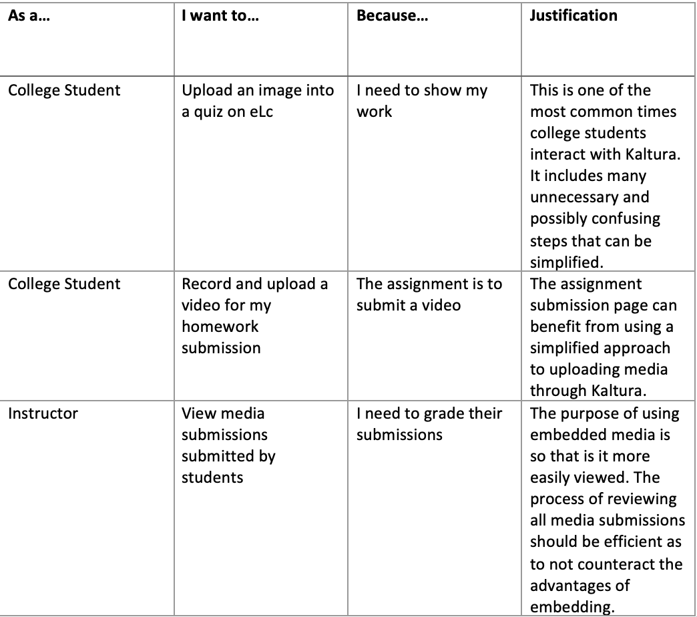
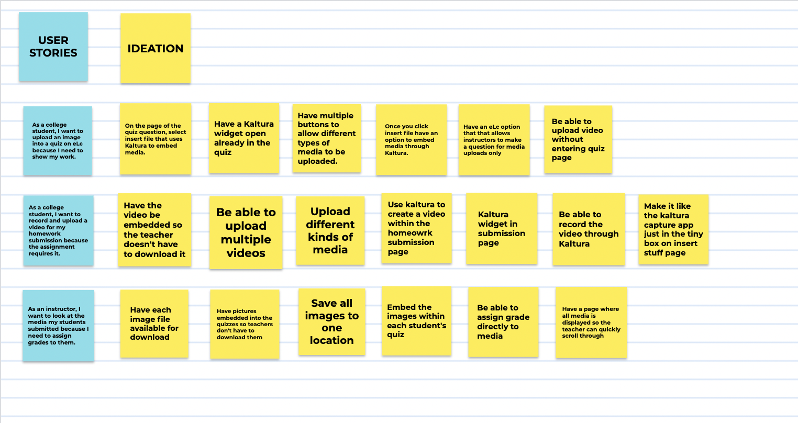

# Milestone 3

## A. User Experience Requirements
<!--
- Decompose your proposed solution from Milestone 2 into related user stories. It is highly recommended that you organize your user stories into a hierarchy based on related activities and tasks.

- Which user stories are most relevant to your proposed solution and why? It could be all of them or perhaps only a few. Whatever you pick, please provide a strong justification with supporting evidence.
-->

### User Story Heirarchy and Justifications
We chose to focus on the usage of Kaltura through eLc for college students and instructors because of our experiences interacting with it in this environment. Research shows that 52% of colleges use Kaltura as their Video Platform (<a href="https://www.streamingmedia.com/Articles/News/Online-Video-News/52-of-Colleges-and-Universities-Use-a-Video-Solution-Kaltura-112291.aspx?utm_content=buffer8bcf5&utm_medium=social&utm_source=plus.google.com&utm_campaign=buffer">Link to Source</a>). This high percentage reflects a large amount of college students and instructors who use Kaltura. For these reasons we have separated our user stories into student and instructor groups.

### College Student User Stories: 
- As a student I want to embed an image into a quiz because I am required to show my work. 
- As a student I want to embed a video that I have already recorded into a quiz because I need explain a topic. 
- As a student I want to record a video using Kaltura capture because I want to use the screen recording feature.
- As a student I want to use Kaltura to add captions to my video because I want all my student peers are able to undertand it. 
- As a student I want to embed media into a discussion because I found an interesting picture to explain my comment.

### Instructor User Stories:
- As an instructor I want to embed a video into the content page because I want my students to rewatch my lectures.
- As an instructor I want to embed an image into a quiz because I want my students to identify a picture.
- As an instructor I want to view all the quiz submissions my students submitted because I want to see the pictures of the work they uploaded.
- As an instructor I want to grade all the assignment submissions because I want to watch the videos they submitted

### Most Relevant User Stories:
<i>"Reviewers note that the user interface is 'clumsy,' that 'there are a number of illogical omissions in their product capabilities,' and that some settings are 'extremely difficult to customize.' These drawbacks are clear in testing." </i> 
<a href="https://www.dacast.com/blog/comparing-kaltura-video-platform-competitors-wowza-and-dacast/">Link to Source</a>

Online reviews of Kaltura state that users find the interface complicated to use. To exemplify this we selected use cases where extra steps or a cluttered interface make Kaltura more difficult to use. Our goal is to streamline the process of uploading and viewing media so that users can experience the benefits of using a paid video platform. 
We selected felt that two student user stories and one instructor user story could be used to exemplify the main problems regarding Kaltura.  
 
Selected User Stories:  
 
A further breakdown of these user stories is presented in the video below.

## B. Ideation and Preliminary Designs

<!--
- For each of the relevant user stories you identified and justified in (A), generate numerous ideas for alternative design solutions that could be used to tell that story, then pick and describe your top two or three ideas for that story.

- Clarification: This step is instructing you to pick two or three top ideas from among the numerous ideas you generated for each relevant user story. That’s two or three ideas per story.

- Note: Although this step only asks for your top two or three ideas, you should include something in your deliverables to illustrate that you did generate numerous ideas, as instructed.

- Suggestion: Take a screenshot of your group’s idea notes (e.g., your sticky notes, Mural canvas, Google Jam board, etc.) after each group ideation session and include that screenshot in your deliverable report before identifying your top picks.

- For each relevant user story, produce a low-fidelity wireframe for each top idea with enough artboards (i.e., frames, pages, screens, etc.) that a potential user might be able to provide useful feedback. Each wireframe should be presented in way that viewers can see all artboards at once (e.g., an image with all the artboards or an embedded canvas) and individually (e.g., links to images of the individual artboards). Each wireframe should also include some justification for why some design decisions were made.

- Suggestion: You may find it easier to think of this step as creating low-fidelity comic-like strips for each of your top ideas where each “panel” in the comic strip is an artboard that illustrates what the experience looks like for a particular part of the story. Consider the user story “as a user, I want to filter the list so that I can focus on a particular kind of item.” Here is a small example that illustrates one idea for how the user might live out that story:
-->
### Group Ideation

### Our Top Picks
<b>User Story: As a college student, I want to upload an image into a quiz on eLc because I need to show my work.</b>
- Idea 1: Add a embed media at the bottom of the question. This embed media button will allow you to upload media from your computer to eLc directly and use Kalturas media viewer so that it is embeded to the question. This effectively removes the requirement of Kalturas tedious upload process. 
Wireframe:

<iframe style="border: 1px solid rgba(0, 0, 0, 0.1);" width="800" height="450" src="https://www.figma.com/embed?embed_host=share&url=https%3A%2F%2Fwww.figma.com%2Fproto%2FiAGdkPIovSaLlySNJEfQrQ%2Fwireframes%3Fnode-id%3D51%253A44%26starting-point-node-id%3D51%3D1%26scaling%3Dcontain" allowfullscreen></iframe>

- Idea 2: On the page of the quiz question have a button to insert a kaltura viewer that is blank. The user can then drag and drop their media or select a file from their computer directly to be uploaded into the viewer.  
Wireframe:

<iframe style="border: 1px solid rgba(0, 0, 0, 0.1);" width="800" height="450" src="https://www.figma.com/embed?embed_host=share&url=https%3A%2F%2Fwww.figma.com%2Fproto%2FiAGdkPIovSaLlySNJEfQrQ%2Fwireframes%3Fnode-id%3D51%253A75%26starting-point-node-id%3D51%3D1%26scaling%3Dcontain" allowfullscreen></iframe>

<b>User Story: As a college student, I want to record and upload a video for my homework submission because the assignment requires it.</b>
- 1
- Wireframe:

<iframe style="border: 1px solid rgba(0, 0, 0, 0.1);" width="800" height="450" src="https://www.figma.com/embed?embed_host=share&url=https%3A%2F%2Fwww.figma.com%2Fproto%2FiAGdkPIovSaLlySNJEfQrQ%2Fwireframes%3Fnode-id%3D123%253A257%26starting-point-node-id%3D123%3D1%26scaling%3Dcontain" allowfullscreen></iframe>

- 2
- Wireframe:

<iframe style="border: 1px solid rgba(0, 0, 0, 0.1);" width="800" height="450" src="https://www.figma.com/embed?embed_host=share&url=https%3A%2F%2Fwww.figma.com%2Fproto%2FiAGdkPIovSaLlySNJEfQrQ%2Fwireframes%3Fnode-id%3D123%253A258%26starting-point-node-id%3D123%3D1%26scaling%3Dcontain" allowfullscreen></iframe>

- 3
- Wireframe:

<iframe style="border: 1px solid rgba(0, 0, 0, 0.1);" width="800" height="450" src="https://www.figma.com/embed?embed_host=share&url=https%3A%2F%2Fwww.figma.com%2Fproto%2FiAGdkPIovSaLlySNJEfQrQ%2Fwireframes%3Fnode-id%3D123%253A259%26starting-point-node-id%3D123%3D1%26scaling%3Dcontain" allowfullscreen></iframe>

<b>User Story: As a college student, I want to record and upload a video for my homework submission because the assignment requires it.</b>
- 1
- Wireframe:

<iframe style="border: 1px solid rgba(0, 0, 0, 0.1);" width="800" height="450" src="https://www.figma.com/embed?embed_host=share&url=https%3A%2F%2Fwww.figma.com%2Fproto%2FiAGdkPIovSaLlySNJEfQrQ%2Fwireframes%3Fnode-id%3D123%253A256%26starting-point-node-id%3D123%3D1%26scaling%3Dcontain" allowfullscreen></iframe>

- 2
- Wireframe:

<iframe style="border: 1px solid rgba(0, 0, 0, 0.1);" width="800" height="450" src="https://www.figma.com/embed?embed_host=share&url=https%3A%2F%2Fwww.figma.com%2Fproto%2FiAGdkPIovSaLlySNJEfQrQ%2Fwireframes%3Fnode-id%3D151%253A311%26starting-point-node-id%3D151%3D1%26scaling%3Dcontain" allowfullscreen></iframe>

 
## C. Detailed Designs
<!--
- For each of the relevant user stories you identified and justified in (A), pick what you think is the best design alternative you wireframed in (B), then produce a higher fidelity mockup of the wireframe. Each mockup should:

- be presented in a manner consistent with your wireframes in (B);

- include a justification for why you think its the best design; and

- include a justification for why design decisions were made.

- You are expected to use use a software tool (e.g., Figma) to create your mockups. For each mockup, you must provide a download link for the source file in addition to one or more exported PNG files.
-->
### User Story 1 - High Fidelity Mockup
<iframe style="border: 1px solid rgba(0, 0, 0, 0.1);" width="800" height="450" src="https://www.figma.com/embed?embed_host=share&url=https%3A%2F%2Fwww.figma.com%2Fproto%2FiAGdkPIovSaLlySNJEfQrQ%2Fwireframes%3Fnode-id%3D47%253A32%26scaling%3Dcontain%26page-id%3D0%253A1%26starting-point-node-id%3D47" allowfullscreen></iframe> 
- We chose this design because...
- Design Decisions: In order to declutter the interfece, we wanted to use as few steps as possible to insert media without limiting user options.

### User Story 2 - High Fidelity Mockup
- We chose this design because...
- Design Decisions: One of the main advantages that Kaltura's competitors have is that they are easier to set up. For this reason we wanted our solution to showcase an option that is simpler to use and set up. <a href="https://www.g2.com/products/kaltura-video-cloud/competitors/alternatives">Link to Source</a>

### User Story 3 - High Fidelity Mockup
- We chose this design because...
- Design Decisions:

## D. Summary Video
<!--
- Create a 5-10 minute video that summarizes the information in parts (A), (B), and (C). The creation of this video should involve all team members, and the video itself should contain credits at the end describing who did what.

- You should provide the link to the video in your milestone deliverable report; if your report is an HTML page, then you may embed the video into the page in addition to providing the link.
-->

[Back to Home](index.md)
